# Variational Classifier

Related Papers:
- https://arxiv.org/pdf/2101.11020.pdf (Maria Schuld)
- https://www.mdpi.com/2073-431X/10/6/71/htm

- ebook: https://link.springer.com/book/10.1007/978-3-319-96424-9

## Some Basics

### Basis, Amplitude and Angle embedding
Quantum Data embedding Methods for Quantum Machine Learning

https://medium.datadriveninvestor.com/all-about-data-encoding-for-quantum-machine-learning-2a7344b1dfef

### Repeated Amplitude Embedding (special case)

| embedding method   |                                                          circuit example                                                          |
| :----------------- | :-------------------------------------------------------------------------------------------------------------------------------: |
| amplitude          |  |
| repeated amplitude |  |

#### Examples from the current implementation of the VC
1 Layer with 2 Qubits (single amplitude embedding):
```
 0: ──RY(0.712)──╭C──────────╭C──X──────╭C──────────────╭C──X───────── | ─Rot(0.0102, 1.29, -4.32e-06)────╭C──┤ ⟨Z⟩
 1: ─────────────╰X──RY(-0)──╰X──RY(0)──╰X──RY(-0.519)──╰X──RY(0.519)─ | ─Rot(0.00231, -1.58, -7.91e-05)──╰X──┤
```
The layers have `2x3=6` weights and all qubits are entangled with a CNOT.

1 Layer with 4 Qubits (**repeated** amplitude embedding):
```
 0: ──RY(0.712)──╭C──────────╭C──X──────╭C──────────────╭C──X───────── | ─Rot(0.00108, -0.963, 0.000439)───╭C──────────╭X──┤ ⟨Z⟩
 1: ─────────────╰X──RY(-0)──╰X──RY(0)──╰X──RY(-0.519)──╰X──RY(0.519)─ | ─Rot(-0.00117, -1.04, -0.00308)───╰X──╭C──────│───┤
 2: ──RY(0.712)──╭C──────────╭C──X──────╭C──────────────╭C──X───────── | ─Rot(0.00106, -0.246, -0.000862)──────╰X──╭C──│───┤
 3: ─────────────╰X──RY(-0)──╰X──RY(0)──╰X──RY(-0.519)──╰X──RY(0.519)─ | ─Rot(-0.00351, -0.489, 0.00503)───────────╰X──╰C──┤
```
The layers have `4x3=12` weights and all qubits are entangled with a CNOT.


## `get_angles()` function

The calculation for the formula for `get_angles()` is described in the following paper; https://arxiv.org/pdf/quant-ph/0407010.pdf, read section II & III.
Additionaly there seems to be a slightly modificated version of the formula in the ebook; https://link.springer.com/book/10.1007/978-3-319-96424-9 (Schuld and Petruccione (2018))

Related link to forum question: https://discuss.pennylane.ai/t/data-encoding-for-a-real-datasets/1090

```python
def get_angles(x):
    beta0 = 2 * np.arcsin(np.sqrt(x[1] ** 2) / np.sqrt(x[0] ** 2 + x[1] ** 2 + 1e-12))
    beta1 = 2 * np.arcsin(np.sqrt(x[3] ** 2) / np.sqrt(x[2] ** 2 + x[3] ** 2 + 1e-12))
    beta2 = 2 * np.arcsin(
        np.sqrt(x[2] ** 2 + x[3] ** 2)
        / np.sqrt(x[0] ** 2 + x[1] ** 2 + x[2] ** 2 + x[3] ** 2)
    )
    return np.array([beta2, -beta1 / 2, beta1 / 2, -beta0 / 2, beta0 / 2])
```

|                                                                                                                     screenshot section II                                                                                                                      |                                                                                                                      screenshot section III                                                                                                                      |
| :------------------------------------------------------------------------------------------------------------------------------------------------------------------------------------------------------------------------------------------------------------: | :--------------------------------------------------------------------------------------------------------------------------------------------------------------------------------------------------------------------------------------------------------------: |
| <a href="images/Transformation%20of%20quantum%20states%20using%20uniformly%20controlled%20rotations%20-%20II.png"></a> | <a href="images/Transformation%20of%20quantum%20states%20using%20uniformly%20controlled%20rotations%20-%20III.png"></a> |


## VC Script and Plots
I created and modified the VC script ([VC_with_pennylane.py](VC_with_pennylane.py)) to contain amplitude embedding and repeated amplitude embedding for comparison. The following plots show the differences for this two approachs

Max. iterations: `250`
Quantum device used: `default.qubit` (pennylane default)
Optimizer: `NesterovMomentumOptimizer` (step size: `0.01`)

| Layers |                         costs                         |                      train/validation plot                       |
| :----- | :---------------------------------------------------: | :--------------------------------------------------------------: |
| 1      |  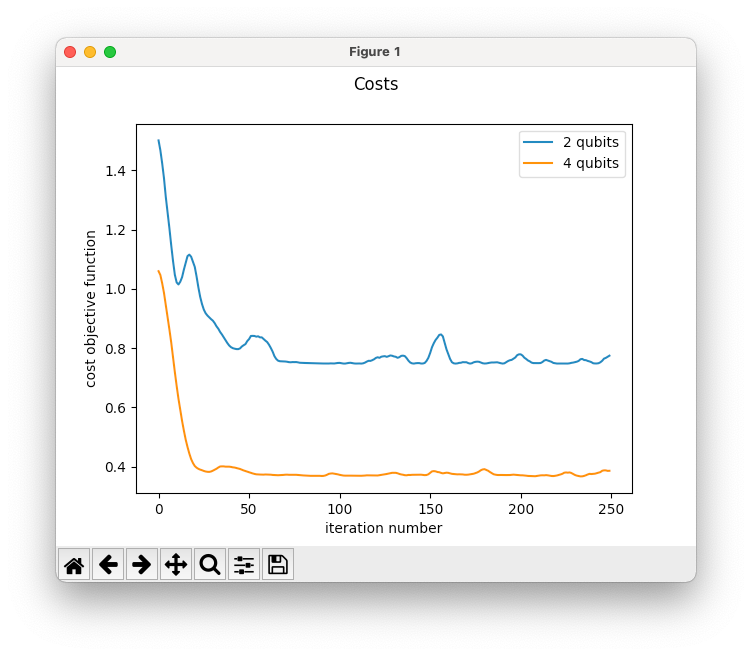  |  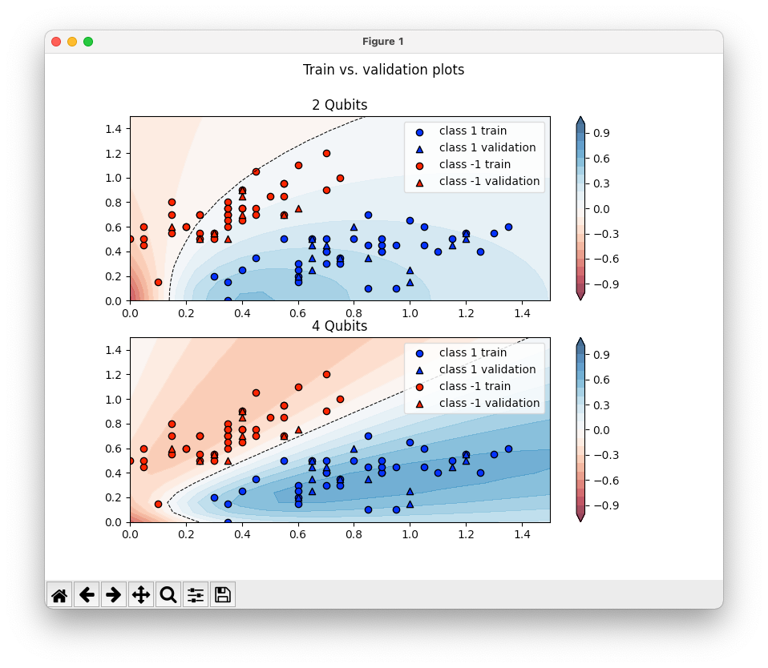  |
| 2      | 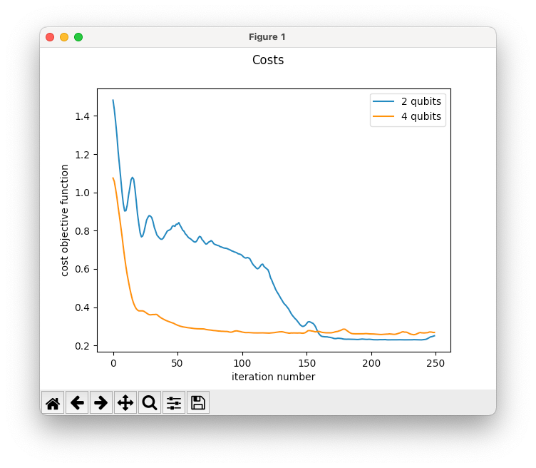  | 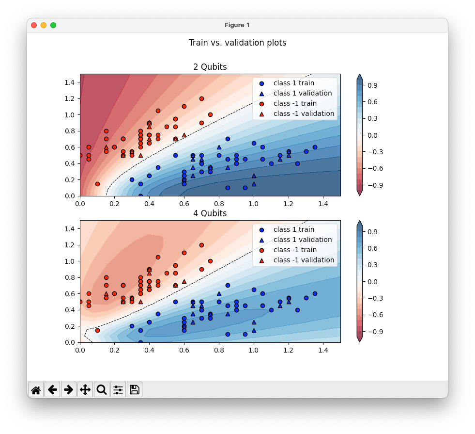  |
| 3      | 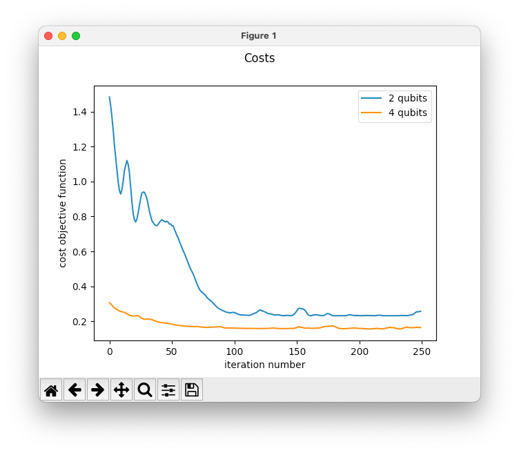  |   |
| 5      | 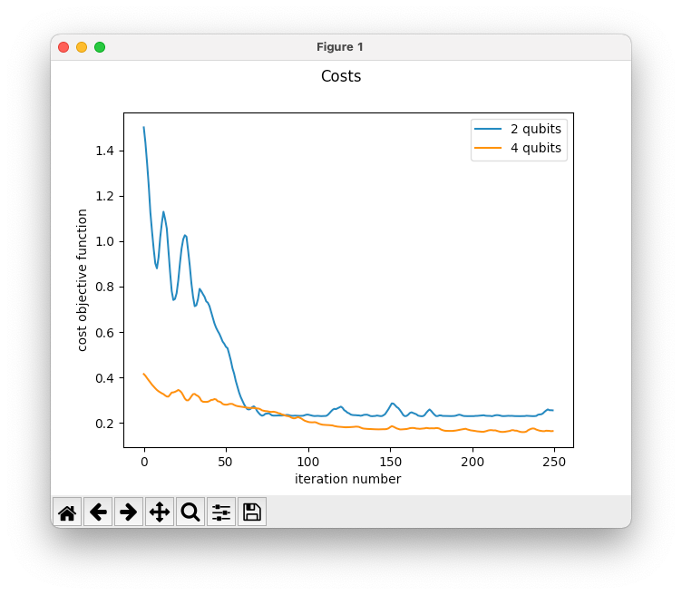  | 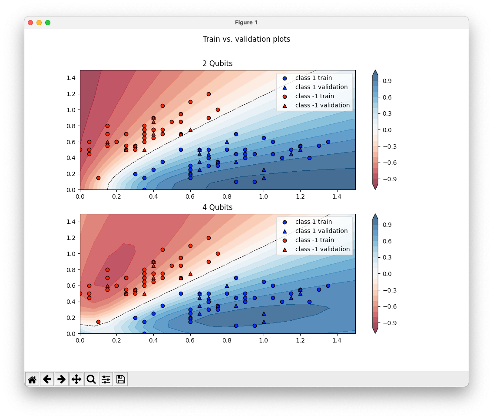  |
| 10     | 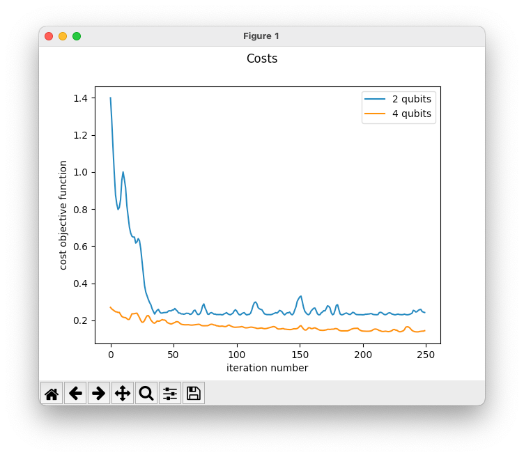 | 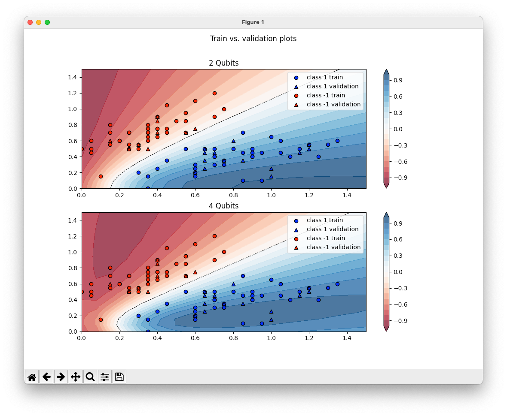 |
| 20     | 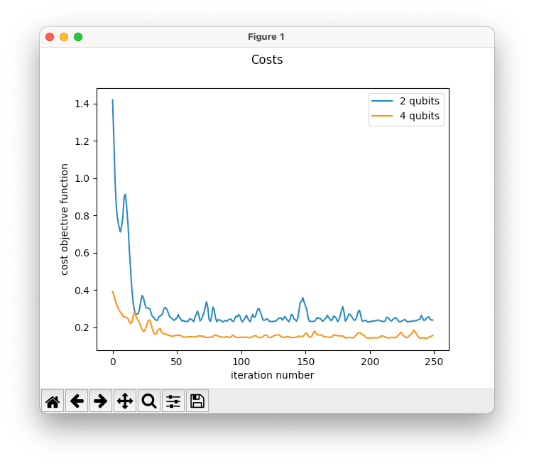 | 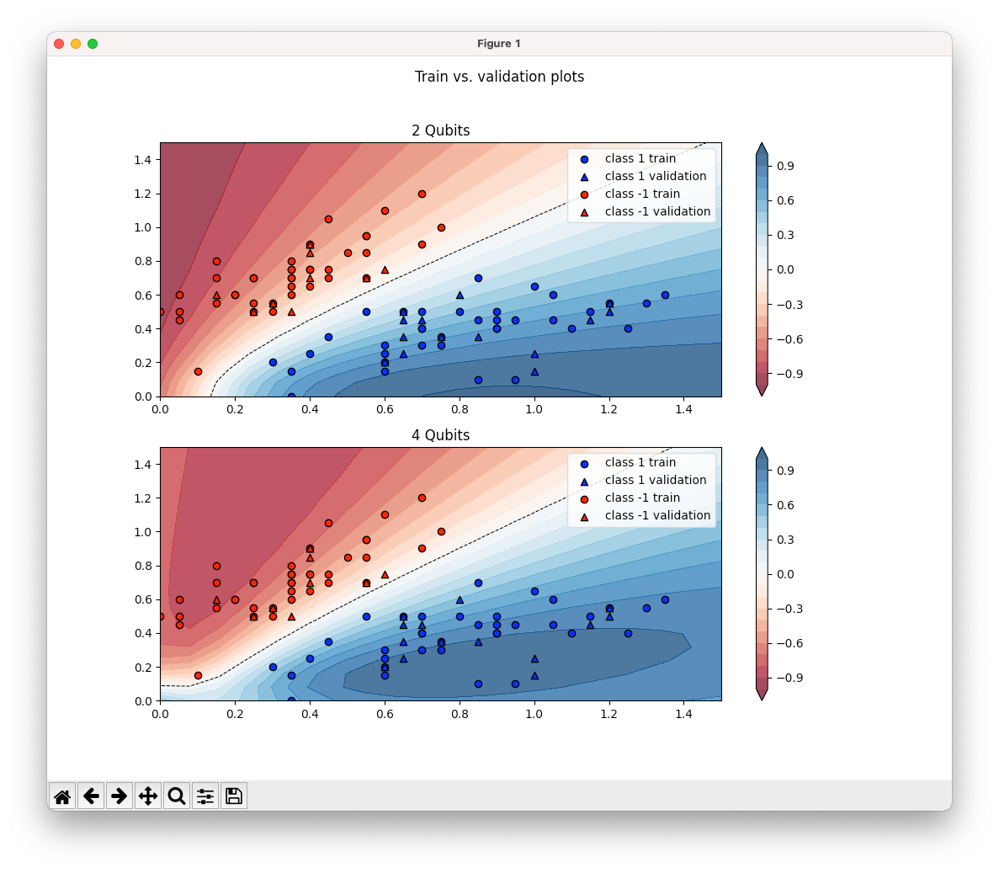 |

Repeated amplitude embedding leads to faster training times and better predictions but uses the double amount of qubits for the same amount of features


