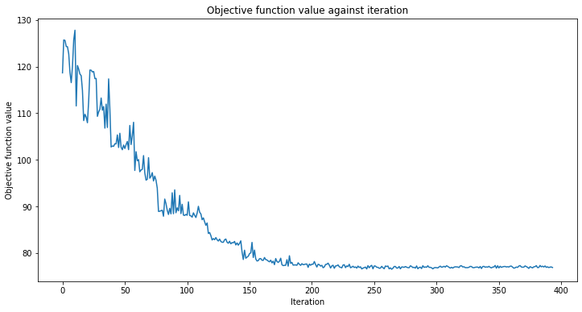
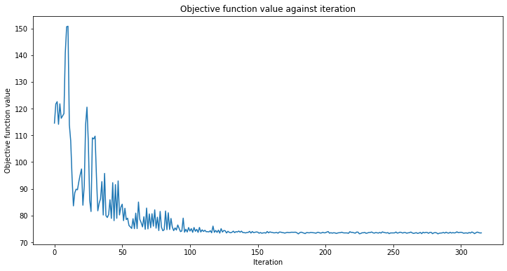
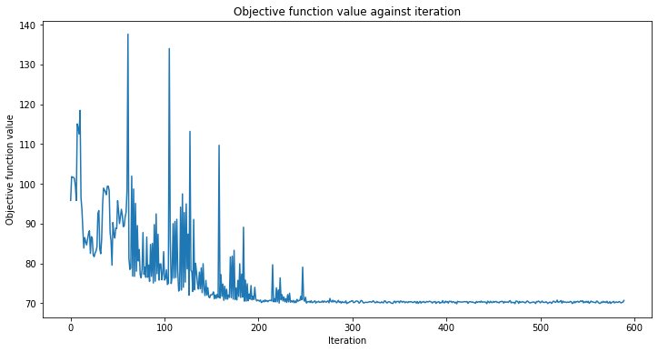
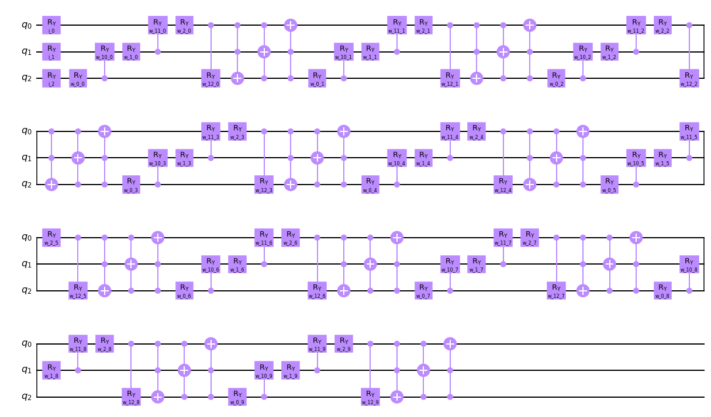
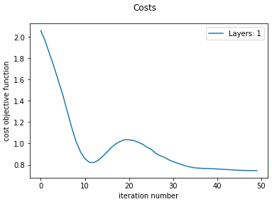

# Heart Failure

## MLPClassifier

| Classic MLPClassifier Accuracy \| Solver: `Adam` | Plot                                                           |
| :----------------------------------------------- | :------------------------------------------------------------- |
| [size: 25, hidden layers: 1]:  `88.33%`          |  |
| [size: 25, hidden layers: 13]:  `91.67%`         |  |
| [size: 25, hidden layers: 25]:  `93.33%`         |  |
| [size: 50, hidden layers: 1]:  `90.00%`          |  |
| [size: 50, hidden layers: 13]:  `93.33%`         |  |
| [size: 50, hidden layers: 25]:  `91.67%`         |  |
| [size: 75, hidden layers: 1]:  `86.67%`          |  |
| [size: 75, hidden layers: 13]:  `90.00%`         |  |
| [size: 75, hidden layers: 25]:  `93.33%`         |  |

## PA Quatum circuit

### Original data
| Quantum Circuit                                                               | Loss function plot                                                                 | Mean Accuracy                                                                                        |
| :---------------------------------------------------------------------------- | :--------------------------------------------------------------------------------- | :--------------------------------------------------------------------------------------------------- |
|           |           | training: `0.5899581589958159` testing: `0.6333333333333333` overall: `0.6020066889632107` |
|   |   | training: `0.7112970711297071` testing: `0.75` overall: `0.7224080267558528`               |
|  |  | traingin: `0.702928870292887` testing: `0.75` overall: `0.7123745819397993`                                                                           |
|  |  | traingin: `0.6861924686192469` testing: `0.75` overall: `0.6956521739130435`                                                                |
### Normalized data
| Quantum Circuit                                                               | Loss function plot                                                                 | Mean Accuracy                                                                         |
| :---------------------------------------------------------------------------- | :--------------------------------------------------------------------------------- | :------------------------------------------------------------------------------------ |
|           |           | training: `0.6778242677824268` testing: `0.7` overall: `0.6822742474916388` |
|   |   | training: `0.698744769874477` testing: `0.75` overall: `0.7090301003344481` |
|  |  | traingin: `0.702928870292887` testing: `0.75` overall: `0.7123745819397993`                        |
|  |  | processing...                                                                         |

#### Other Circuits

**Cascade mirrored**

| Quantum Circuit                                                              | Loss function plot                                                                | Mean Accuracy                                                                                        |
| :--------------------------------------------------------------------------- | :-------------------------------------------------------------------------------- | :--------------------------------------------------------------------------------------------------- |
|          |          | training: `0.694560669456067` testing: `0.7166666666666667` overall: `0.7023411371237458`  |
|  |  | training: `0.6820083682008368` testing: `0.7333333333333333` overall: `0.6923076923076923` |
|  todo change image here |  | processing...                      |

**Entangle all qubits with cx**

| Quantum Circuit                                                              | Loss function plot                                                                | Mean Accuracy                                                                                        |
| :--------------------------------------------------------------------------- | :-------------------------------------------------------------------------------- | :--------------------------------------------------------------------------------------------------- |
|          |          | training: `0.6694560669456067` testing: `0.7166666666666667` overall: `0.6789297658862876` |
|  |  | training: `0.6903765690376569` testing: `0.7333333333333333` overall: `0.6989966555183946` |
|  |  | processing...                      |

**Entangle all qubits with ccx**

| Quantum Circuit                                                              | Loss function plot                                                                | Mean Accuracy                                                                                        |
| :--------------------------------------------------------------------------- | :-------------------------------------------------------------------------------- | :--------------------------------------------------------------------------------------------------- |
|          |          | training: `0.6861924686192469` testing: `0.7166666666666667` overall: `0.6923076923076923` |
|  |  | training: `0.6903765690376569` testing: `0.7333333333333333` overall: `0.7023411371237458` |
|  |  | processing...                      |

**Hadamard start and end**

| Quantum Circuit                                                              | Loss function plot                                                                | Mean Accuracy                                                                                       |
| :--------------------------------------------------------------------------- | :-------------------------------------------------------------------------------- | :-------------------------------------------------------------------------------------------------- |
|          |          | training: `0.698744769874477` testing: `0.7166666666666667` overall: `0.6989966555183946` |
|  |  | training: `0.6778242677824268` testing: `0.7333333333333333` overall: `0.68561872909699`  |
|  |  | processing...                      |

**More weights (UGate)**

| Quantum Circuit                                                              | Loss function plot                                                                | Mean Accuracy                                                                                        |
| :--------------------------------------------------------------------------- | :-------------------------------------------------------------------------------- | :--------------------------------------------------------------------------------------------------- |
|          |          | training: `0.702928870292887` testing: `0.75` overall: `0.7023411371237458`                |
|  |  | training: `0.6861924686192469` testing: `0.7166666666666667` overall: `0.6989966555183946` |
|  |  | processing...                      |

**More weights (UGate), no entanglement**

| Quantum Circuit                                                              | Loss function plot                                                                | Mean Accuracy                                                                         |
| :--------------------------------------------------------------------------- | :-------------------------------------------------------------------------------- | :------------------------------------------------------------------------------------ |
|          |          | training: `0.6778242677824268` testing: `0.7` overall: `0.6822742474916388` |
|  |  | training: `0.6736401673640168` testing: `0.7` overall: `0.68561872909699`   |
|  |  | processing...                      |

**Early cx gates, ugate**

| Quantum Circuit                                                              | Loss function plot                                                                | Mean Accuracy                                                                                        |
| :--------------------------------------------------------------------------- | :-------------------------------------------------------------------------------- | :--------------------------------------------------------------------------------------------------- |
|          |          | training: `0.6694560669456067` testing: `0.7166666666666667` overall: `0.6789297658862876` |
|  |  | training: `0.6694560669456067` testing: `0.7166666666666667` overall: `0.6789297658862876` |
|  |  | processing...                      |

**Ugate and cx instead of ry and cry**

| Quantum Circuit                                                              | Loss function plot                                                                | Mean Accuracy                                                                                        |
| :--------------------------------------------------------------------------- | :-------------------------------------------------------------------------------- | :--------------------------------------------------------------------------------------------------- |
|          |          | training: `0.6694560669456067` testing: `0.7166666666666667` overall: `0.6789297658862876` |
|  |  | training: `0.6820083682008368` testing: `0.7166666666666667` overall: `0.6956521739130435` |
|  |  | processing...                      |

**Only features and two weights**

| Quantum Circuit                                                              | Loss function plot                                                                | Mean Accuracy                                                                         |
| :--------------------------------------------------------------------------- | :-------------------------------------------------------------------------------- | :------------------------------------------------------------------------------------ |
|          |          | training: `0.6736401673640168` testing: `0.7` overall: `0.6822742474916388` |
|  |  | training: `0.6778242677824268` testing: `0.7` overall: `0.6822742474916388` |
|  |  | processing...                      |

## Pennylane Costs

| Classic = MLPClassifier                                                                                                               | Quantum Hybrid with Pennylane                                                                                                                                                                                        |
| :------------------------------------------------------------------------------------------------------------------------------------ | :------------------------------------------------------------------------------------------------------------------------------------------------------------------------------------------------------------------- |
|  Hidden layer size: 2, Layers 15 Max. 300 iterations - solver 'Adam' |  heartFailure_quantum_pa_circuit_single 25 iterations - Overall cost: 0.7494543 \| Acc train: 0.6875000 \| Acc validation: 0.6666667 |
|  Hidden layer size: 2, Layers 15 First 20 iterations - solver 'Adam' |  heartFailure_quantum_pa_circuit 75 iterations - Overall cost: 0.6581579 \| Acc train: 0.8392857 \| Acc validation: 0.8133333               |
| "                                                                                                                                     |  heartFailure_quantum_repeated 30 iterations - Overall cost: 0.8352485 \| Acc train: 0.7053571 \| Acc validation: 0.6533333                   |
| "                                                                                                                                     |  heartFailure_quantum 50 iterations - Overall cost: 0.9220091 \| Acc train: 0.6428571 \| Acc validation: 0.6133333                                     |
